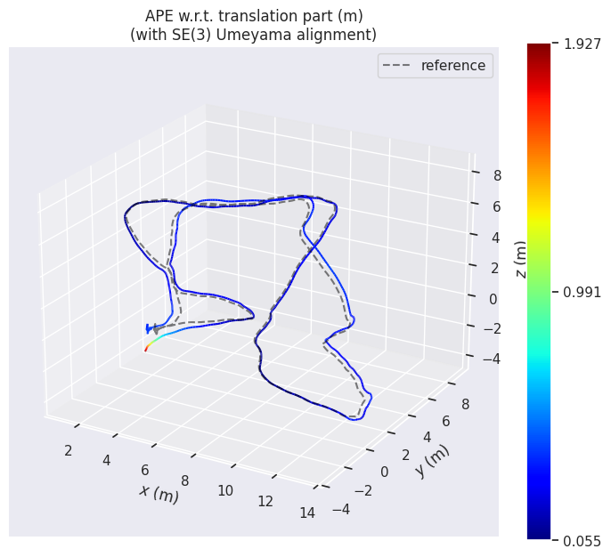
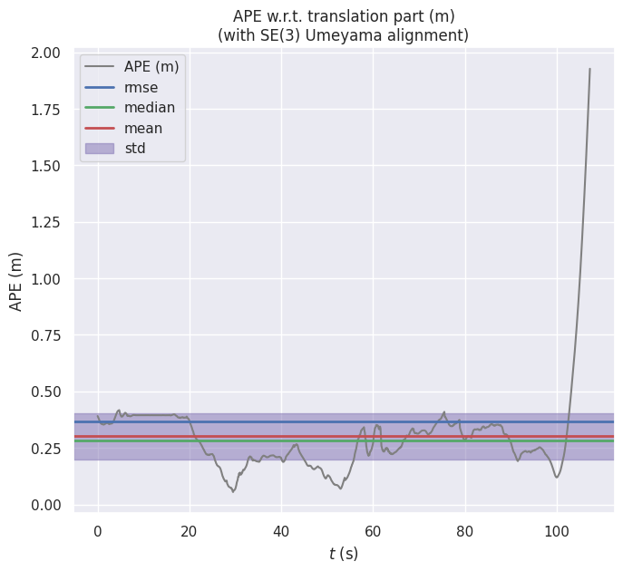

# Vins tutorial

**Desicription**：
This is a code base developed for reference and tutorial/teaching purposes. It is based on the VINS-Mono framework but does not rely on ROS, Ceres, or G2o. The code is quite basic and aims to demonstrate common algorithms in SLAM optimization, including backend LM algorithms, sliding window algorithms, robust kernel functions, etc., using only the Eigen library.


### Installation Dependencies：

1. pangolin: <https://github.com/stevenlovegrove/Pangolin>

2. opencv

3. Eigen

4. Ceres(2.1.0): The VINS initialization part uses Ceres for Structure from Motion (SfM), so we still need to rely on Ceres.

### Compiling the Code

```c++
mkdir vislam
cd vislam
mkdir build 
cd build
cmake ..
make
```

### Running the Code
#### 1. CurveFitting Example to Verify Our Solver.
```c++
cd build
../bin/testCurveFitting 
```

#### 2. VINS-Mono on Euroc Dataset
```c++
cd build
../bin/run_euroc /home/dataset/EuRoC/MH-05/mav0/ ../config/
```

#### 3. Validation Results
[evo package](https://github.com/MichaelGrupp/evo)
```c++
evo_ape euroc euroc_mh05_groundtruth.csv pose_output.txt -a -p
```

## Results from Euroc-MH05





